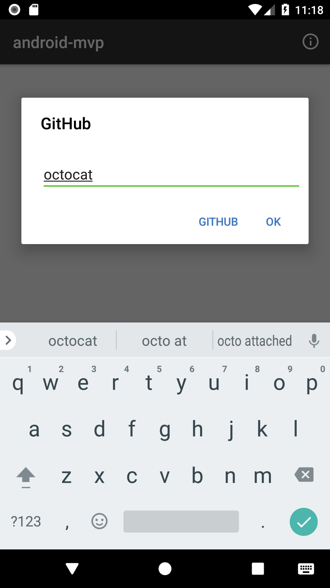
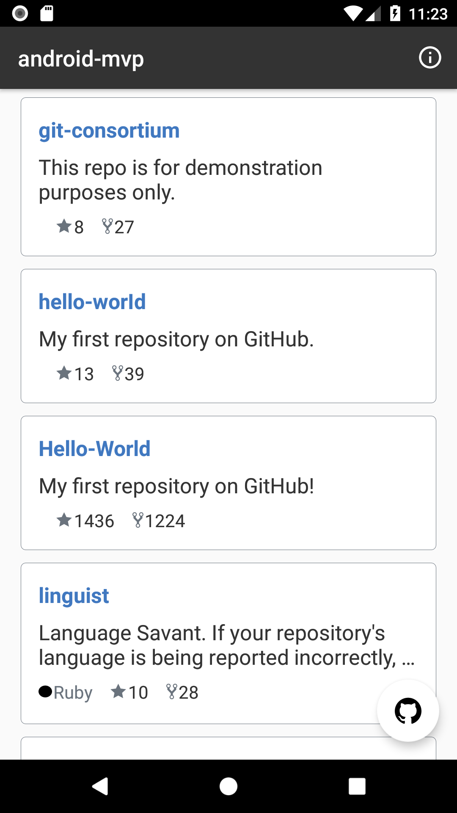
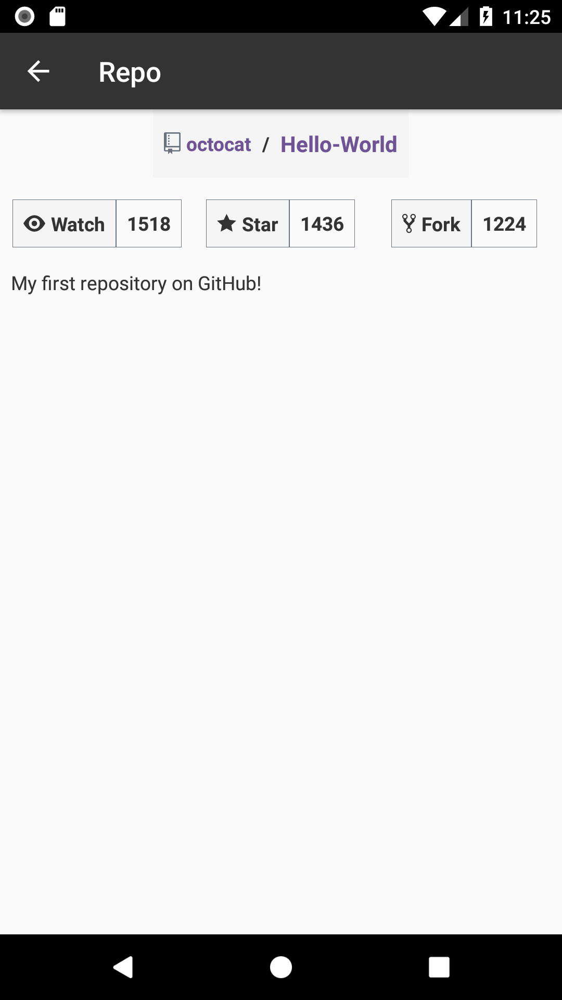
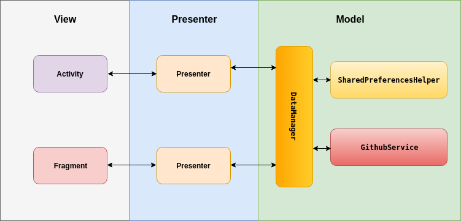

Android-MVP
=======
###### ...Simple Android MVP Architecture sample using the Github API

Info
--------
The Github Logo and GitHub icons are a property of <a href="https://www.github.com/" title="GitHub">Github</a>

Screenshots
----------

  

Architecture
----------
This app is built using the MVP - Model View Presenter Pattern.  
Communication between different layers is done with the use of interfaces in order to hide internal logic.

APIs Used
----------
**https://api.github.com/users/{username}/repos**
**https://api.github.com/repos/{owner}/{repo}**

Libraries used
--------
- [**Butter Knife**](http://jakewharton.github.io/butterknife/): **Field and method binding for Android views.**  
- [**Dagger 2**](https://google.github.io/dagger/): **A fast dependency injector for Android and Java.**  
- [**Retrofit**](https://square.github.io/retrofit/): **A type-safe HTTP client for Android and Java.**  
- [**RxAndroid**](http://jakewharton.github.io/butterknife/): **RxJava bindings for Android.**  
- [**Timber**](https://github.com/JakeWharton/timber): **A logger with a small, extensible API which provides utility on top of Android's normal Log class.**  

Building
--------

To build a debug version, run this from the root of the project:

    ./gradlew app:assembleDebug
A Debug .apk file will be created in the **app/build/outputs/apk/** folder.

Quality Control
-------

To run the unit tests:

	./gradlew app:testDebugUnitTest
Test Summary will be generated in the **app/build/reports/tests/testDebugUnitTest/index.html** file.

To run instrumentation tests:

	./gradlew app:connectedAndroidTest
Test Summary will be generated in the **app/build/reports/androidTests/connected/index.html** file.

  License
--------

    Copyright 2018 Tunji Olu-Taiwo

    Licensed under the Apache License, Version 2.0 (the "License");
    you may not use this file except in compliance with the License.
    You may obtain a copy of the License at

       http://www.apache.org/licenses/LICENSE-2.0

    Unless required by applicable law or agreed to in writing, software
    distributed under the License is distributed on an "AS IS" BASIS,
    WITHOUT WARRANTIES OR CONDITIONS OF ANY KIND, either express or implied.
    See the License for the specific language governing permissions and
    limitations under the License.
